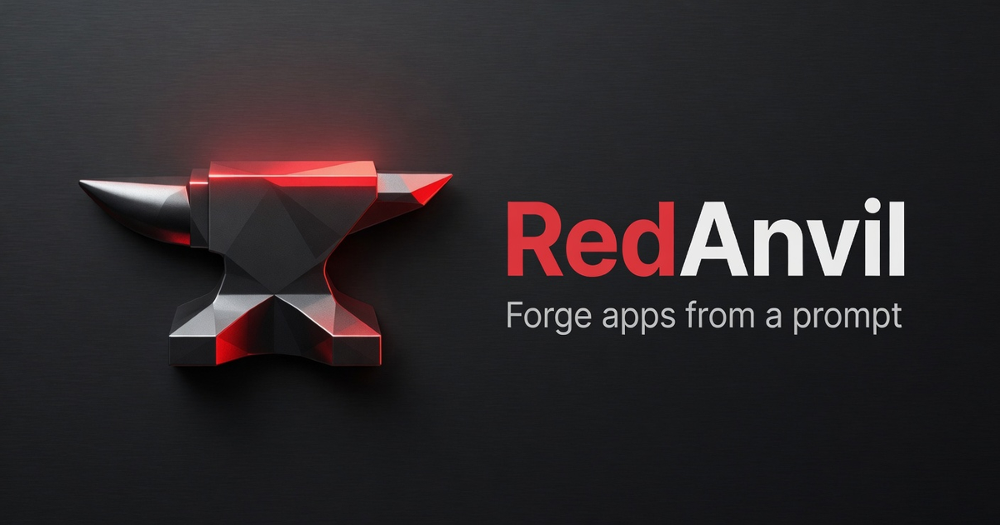
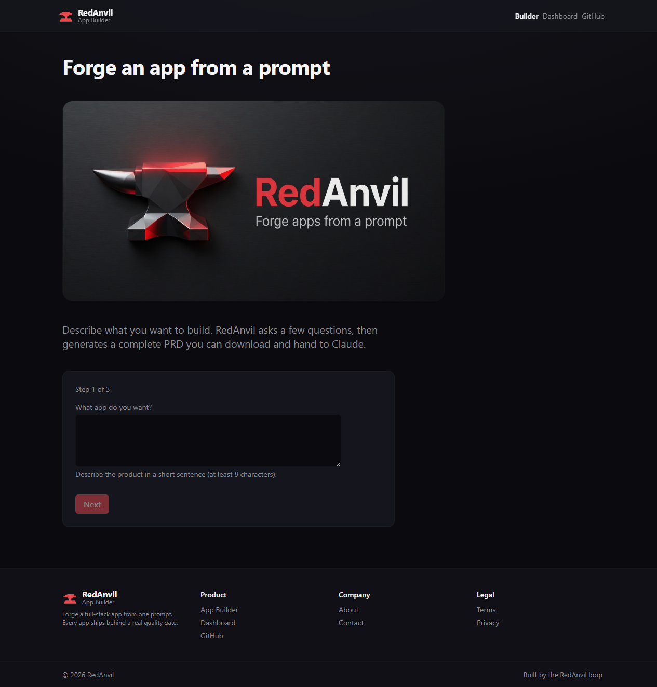
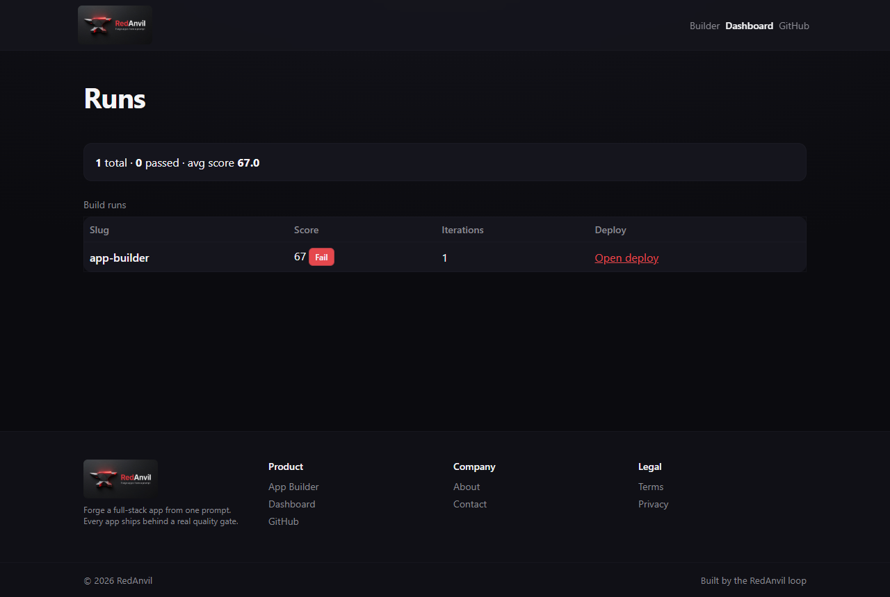

# RedAnvil

Forge a full app from one prompt, behind a real quality gate.



RedAnvil is a system where Claude Code orchestrates an autonomous build loop: Grok Build writes the code, Claude does QA and management, and a judge scores the result against a fixed rubric until it clears a threshold (default 90) or a max-iteration cap. It also ships a public app-builder that turns a prompt into a downloadable PRD, and a dashboard that shows build runs.

## Live

- App builder: https://redanvil.pages.dev
- Dashboard: https://redanvil-dashboard.pages.dev

## Screens

| App builder | Dashboard |
|---|---|
|  |  |

## What it does

- App builder. Describe an app, answer a short clarifying-questions wizard, and get a complete PRD: features with acceptance criteria, a data model, the enforced tech stack, a test plan, an effort estimate, and a ready-to-paste build prompt. Download it as markdown, save it to the site, or hand it to a coding agent.
- Build loop. A local orchestrator drives Grok Build to implement a spec, scores the result against the rubric, feeds failures back, and repeats. The score is the only signal that counts; Grok's self-report is never trusted.
- Dashboard. Shows each run's slug, score, pass or fail, iterations, and deploy URL, read live from the results feed.

## How the loop works

1. Claude writes the spec and delegates it to Grok Build (bounded, isolated, no deploy authority).
2. Grok codes it.
3. Claude reviews the diff and runs the gate: tsc, eslint, tests, build, a runtime-parity check (`wrangler pages dev` plus a live endpoint), and a real visual review at 375, 768, and 1280 px. It computes a 0-100 score.
4. Below threshold, the failures feed back and the loop iterates. At or above, it deploys and verifies by asset hash.

Everything runs inline with a no-stall protocol. Every Grok call and gate check goes through a bounded, killable runner, so a wedged subprocess can never hang the loop.

## The quality gate

- Tier-1 deterministic blockers: strict typing, no `any`, tests present and passing, build succeeds, secret scan, no committed binaries, env ignored.
- Tier-2 capped judge, held to 30 percent of tier-2 weight: concision, single-purpose modules, componentization, fail-closed UI, safe copy. Scored with evidence, never rubber-stamped.
- Rule applicability: lanes that do not apply to an app (for example CI on an app with no workflows) are excluded from the score.
- Design gate: a global hook fires on every deploy and requires a real rendered-page visual review before anything is called done. Design rules are verified from screenshots, not code.

Run it with `redanvil gate <app> --threshold 90`. It exits non-zero below the bar.

## Tech stack

Generated apps and the two web surfaces run on Cloudflare Pages, Pages Functions, and D1, with Web Crypto (PBKDF2 and HMAC-SHA256) for auth. No Express, bcrypt, jsonwebtoken, better-sqlite3, or Node-only globals. The orchestrator is a strict-TypeScript CLI (Node 20+, Zod, Vitest).

## Repo layout

```
orchestrator/     the loop, scoring gate, bounded runner, Grok harness, CLI  (redanvil)
rules/            the enforced corpus: base-15, rubric lanes, per-app pack, loop-gate
prompts/          orchestrator, Grok-coder, and judge system prompts
design-system/    tokens, mobile-design-rules, screen-patterns, checklist
app-builder/      the prompt-to-PRD app (Cloudflare Pages + D1)
dashboard/        read-only run viewer (Cloudflare Pages)
results/          per-run scores and the dashboard feed
backups/          D1 exports
docs/             design specs, plans, simulation notes, images
```

## Develop

```bash
npm install          # orchestrator workspace
npm run typecheck && npm run lint && npm test
npm -w @redanvil/orchestrator run dev -- rubric      # print the rubric
npm -w @redanvil/orchestrator run dev -- gate <dir>  # run the gate on an app
```

Each app builds and deploys on its own:

```bash
cd app-builder && npm ci && npm run build
npx wrangler pages deploy ./dist --project-name=redanvil
```

CI (GitHub Actions) typechecks, tests, and builds everything on every push.

## Status

The orchestrator engine, scoring gate, scaffolder, and both live apps are shipped and verified. The app-builder passes the gate at 98/100. Ongoing work: an automated visual and UAT judge subagent, and full SAST coverage.

Built with Claude Code and Grok Build.
