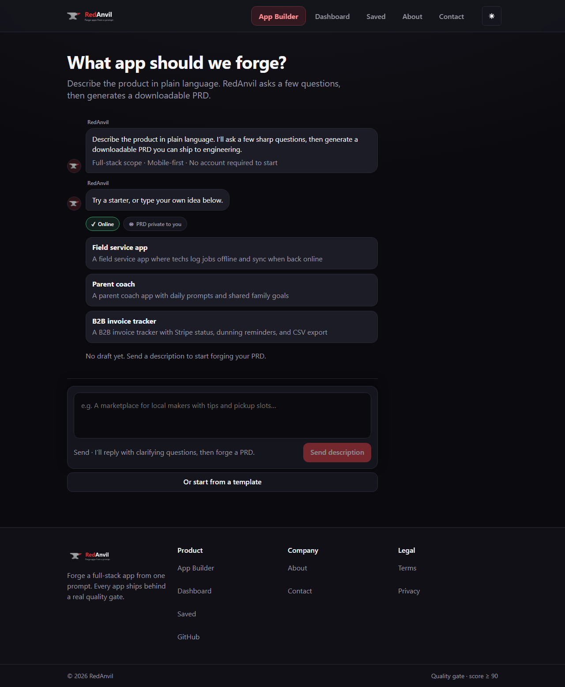
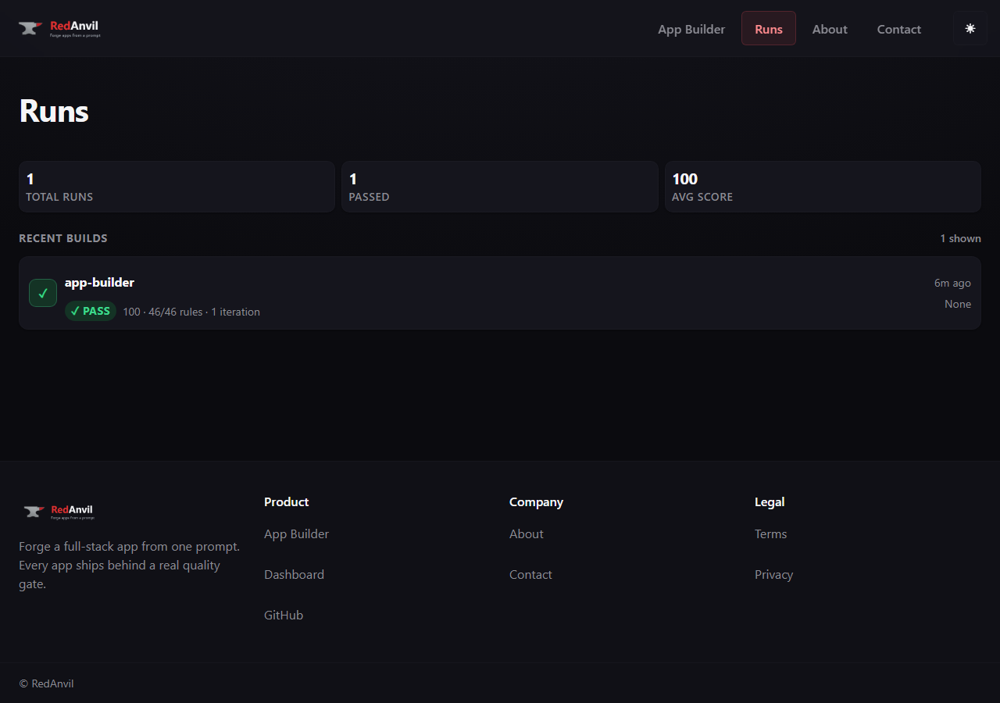

# RedAnvil

Forge a full app from one prompt, behind a real quality gate.


RedAnvil is a system where Claude Code orchestrates an autonomous build loop: Grok Build writes the code, Claude does QA and management, and a judge scores the result against a fixed rubric until it clears a threshold (default 90) or a max-iteration cap. It also ships a public app-builder that turns a prompt into a downloadable PRD, and a dashboard that shows build runs.

## Live

- App builder: https://redanvil.pages.dev
- Dashboard: https://redanvil-dashboard.pages.dev

## Screens

| App builder                                 | Dashboard                               |
| ------------------------------------------- | --------------------------------------- |
|  |  |

## What it does

- App builder. Describe an app, answer a short clarifying-questions wizard, and get a complete PRD: features with acceptance criteria, a data model, the enforced tech stack, a test plan, an effort estimate, and a ready-to-paste build prompt. Download it as markdown, save it to the site, or hand it to a coding agent.
- Build loop. A local orchestrator drives Grok Build to implement a spec, scores the result against the rubric, feeds failures back, and repeats. The score is the only signal that counts; Grok's self-report is never trusted.
- Dashboard. Shows each run's slug, score, pass or fail, iterations, and deploy URL, read live from the results feed.

## How the loop works

1. Claude writes the spec and delegates it to Grok Build (bounded, isolated, no deploy authority).
2. Grok codes it.
3. Claude reviews the diff and runs the gate: tsc, eslint, tests, build, a runtime-parity check (`wrangler pages dev` plus a live endpoint), and a real visual review at 375, 768, and 1280 px. It computes a 0-100 score.
4. Below threshold, the failures feed back and the loop iterates. At or above, it deploys and verifies by asset hash.

Everything runs inline with a no-stall protocol. Every Grok call and gate check goes through a bounded, killable runner, so a wedged subprocess can never hang the loop.

## The quality gate

- Tier-1 deterministic blockers: strict typing, no `any`, tests present and passing, build succeeds, secret scan, no committed binaries, env ignored.
- Tier-2 capped judge, held to 30 percent of tier-2 weight: concision, single-purpose modules, componentization, fail-closed UI, safe copy. Scored with evidence, never rubber-stamped.
- Rule applicability: lanes that do not apply to an app (for example CI on an app with no workflows) are excluded from the score.
- Design gate: a global hook fires on every deploy and requires a real rendered-page visual review before anything is called done. Design rules are verified from screenshots, not code.

Unknown means fail. A rule with no recorded outcome does not quietly pass — for any method, including a rule declared in the rubric with no check wired up yet. A rule that genuinely does not apply is excluded by lane, which drops it from the denominator instead of inventing a pass for it.

Run it from the repo root:

```bash
npm run gate -- app-builder --threshold 90 \
  --judge evidence/verdicts-app-builder.json --na ci,process
```

It exits non-zero below the bar.

## Tech stack

Generated apps and the two web surfaces run on Cloudflare Pages, Pages Functions, and D1, with Web Crypto (PBKDF2 and HMAC-SHA256) for auth. No Express, bcrypt, jsonwebtoken, better-sqlite3, or Node-only globals. The orchestrator is a strict-TypeScript CLI (Node 20+, Zod, Vitest).

## Repo layout

```
orchestrator/     the loop, scoring gate, bounded runner, Grok harness, CLI  (redanvil)
rules/            the enforced corpus: base-15, rubric lanes, per-app pack, loop-gate
prompts/          orchestrator, Grok-coder, and judge system prompts
design-system/    tokens, mobile-design-rules, screen-patterns, checklist
app-builder/      the prompt-to-PRD app (Cloudflare Pages + D1)
dashboard/        read-only run viewer (Cloudflare Pages)
results/          per-run scores and the dashboard feed
backups/          D1 exports
docs/             design specs, plans, simulation notes, images
```

## Develop

```bash
npm install          # orchestrator workspace
npm run typecheck && npm run lint && npm test
npm run rubric                    # print the rubric
npm run gate -- <appDir>          # run the gate on an app (path from repo root)
```

Each app builds and deploys on its own:

```bash
cd app-builder && npm ci && npm run build
npx wrangler pages deploy ./dist --project-name=redanvil
```

CI (GitHub Actions) typechecks, tests, and builds everything on every push.

## Scores, and why every app currently reads 0

Every app in the dashboard shows a score of **0** against a threshold of 90. That
is the gate working, not the project rotting, and it is worth understanding
before reading anything else here.

The rubric is 96 rules, and 69 of them are blockers. A blocker does not shade the
score down a few points -- it zeroes the whole thing. So 0 means "at least one
blocking rule is open", never "nothing works". All six apps are deployed and
serving right now:

| App | Live | State |
| --- | --- | --- |
| App builder | https://redanvil.pages.dev | axe clean in both themes (0 violations, 2026-08-21); 26 gate blockers open |
| Dashboard | https://redanvil-dashboard.pages.dev | live; gate blockers open |
| AZ Planting Calendar | https://az-planting-calendar.pages.dev | 12/12 design rules pass, 121 tests across 3 lanes |
| Sushi Finder | https://sushi-finder.pages.dev | live, gate blockers open |
| Pet Sitter | https://pet-sitter-vz1.pages.dev | live, gate blockers open |
| QuickFlight | https://quickflight.pages.dev | live, re-gated against the current rubric |

A note on the two rows above, because the distinction matters when reading a 0.
They previously read "12/12 design rules pass". That was recorded from a real run
and then went stale: design verdicts are pinned to the commit they were measured
at, and every later commit — including commits that touch nothing those rules
look at — invalidates them. Fail-closed means an unrecorded verdict FAILS, so
rules whose subject is visibly fine (`fe-premium-nav`, `fe-required-pages`,
`fe-no-attribution` — all confirmed by screenshot on 2026-08-21) still count as
blockers until re-measured. That is the rubric working as designed, but "12/12
pass" stated as present tense was a claim the gate no longer supported, so it is
gone. The axe result is dated because it was re-run.

The most common open blockers are `lg-shipped` (the app must be pushed AND the
score must already meet the bar, which is circular for an app still below it),
`lg-result-reproduces`, and rules that were added to the rubric after an app was
last measured. **An unmeasured rule fails closed** -- it does not quietly pass --
so growing the rubric retroactively lowers scores until each app is re-gated.
That is deliberate. The alternative is a number that flatters whatever was
checked last.

An earlier version of this section claimed the app-builder passed at 100/100
across 41 of 41 applicable rules. That was true when it was written, against a
41-rule rubric. The rubric is 96 rules now and the same app scores 0. The old
number is left here as a correction rather than quietly deleted, because a
portfolio that only shows its best measurement is the thing this gate exists to
prevent.

## Status

The orchestrator engine, scoring gate, scaffolder, and both web surfaces are
shipped and running. What the gate measures is real end to end: deterministic
checks, a judge tier where each verdict cites file:line evidence, and a visual
tier measured on the rendered page with contrast via axe-core. Every verdict's
evidence path is checked to exist on disk, the verdicts file is hashed into
provenance, verdicts expire when the code they vouch for changes, and CI
reproduces the whole result rule by rule rather than trusting the committed
file. The repo's own CI-lane blockers are scored separately, since generated
apps have no workflows.

Open work, stated plainly: no app clears the finish line yet; a `results-provenance`
CI job is killed intermittently by its runner with no log persisted; and verdict
freshness is pinned to repo HEAD rather than to the commit that produced the
evidence, so an edit to shared code marks unrelated apps stale.

Built with Claude Code and Grok Build.
